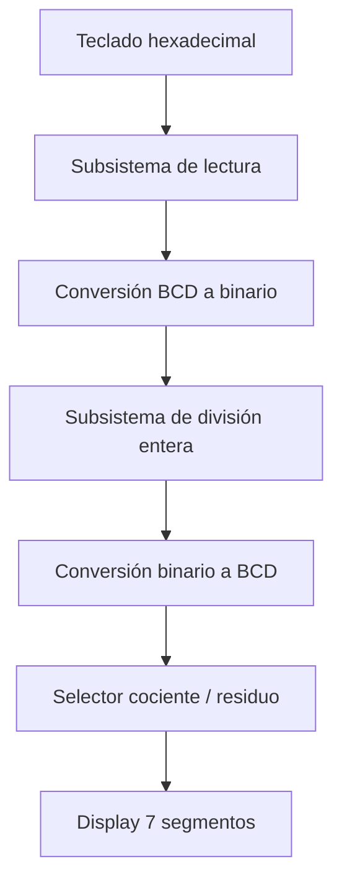
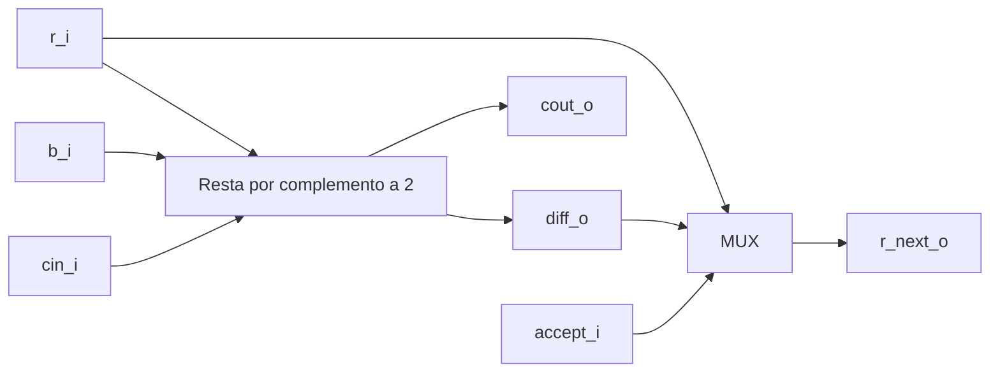
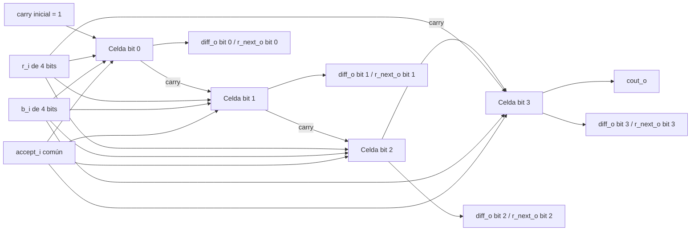
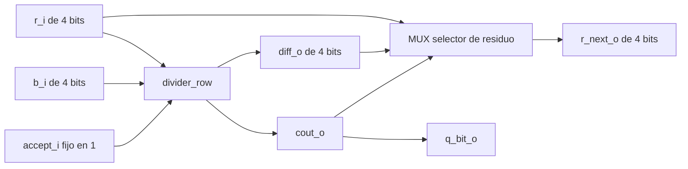
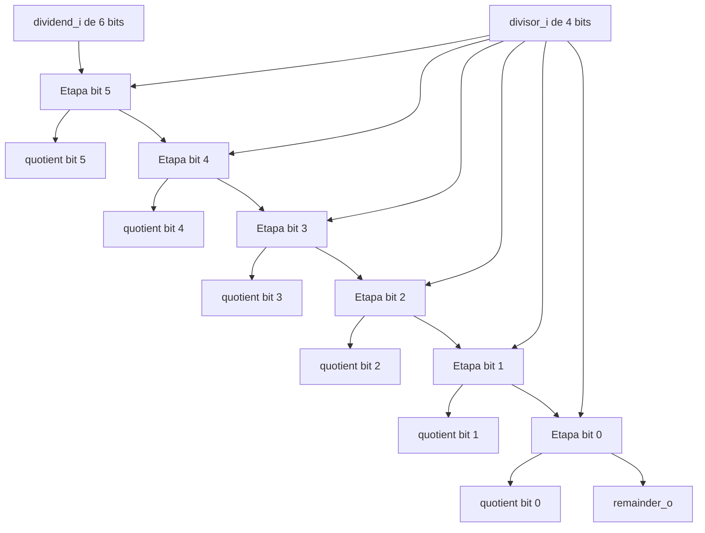
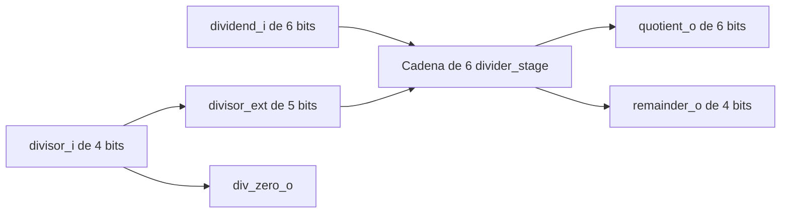
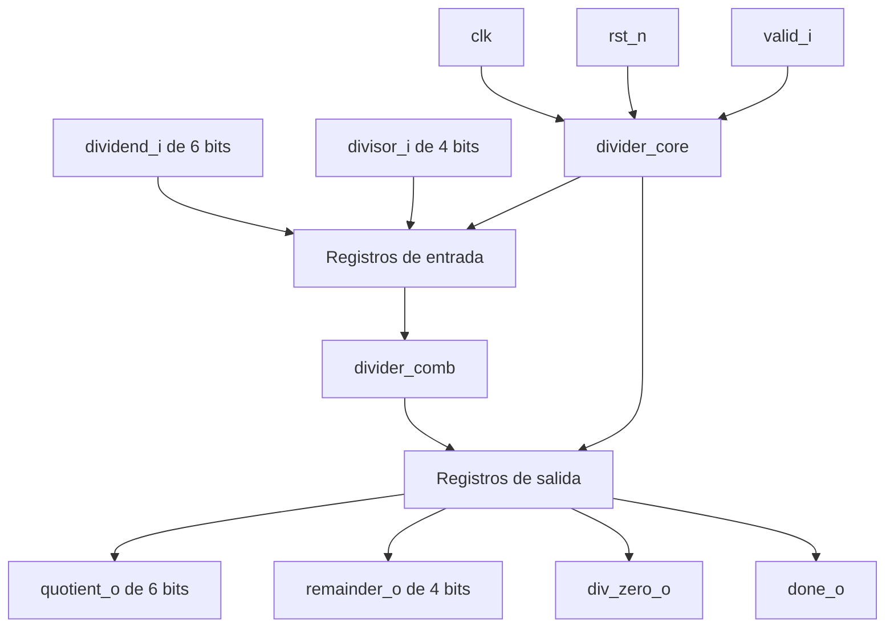

# Nombre del proyecto

## 1. Abreviaturas y definiciones
- **FPGA**: Field Programmable Gate Arrays

## 2. Referencias
[0] David Harris y Sarah Harris. *Digital Design and Computer Architecture. RISC-V Edition.* Morgan Kaufmann, 2022. ISBN: 978-0-12-820064-3

## 3. Desarrollo

### 3.0 Descripción general del sistema

### 3.1 Módulo 1
#### 1. Encabezado del módulo
```SystemVerilog
module mi_modulo(
    input logic     entrada_i,      
    output logic    salida_i 
    );
```
#### 2. Parámetros
- Lista de parámetros

#### 3. Entradas y salidas:
- `entrada_i`: descripción de la entrada
- `salida_o`: descripción de la salida

#### 4. Criterios de diseño
Diagramas, texto explicativo...

#### 5. Testbench
Descripción y resultados de las pruebas hechas

### Otros modulos
- agregar informacion siguiendo el ejemplo anterior.


## 4. Consumo de recursos

## 5. Problemas encontrados durante el proyecto

## Diagramas para informe

**Diagrama general**


**Diagrama divider_cell**

Celda básica de 1 bit que realiza una resta por complemento a dos y selecciona entre el resultado calculado o el residuo original según accept_i.

**Diaframa divider_row**

Fila de 4 bits construida a partir de varias celdas divider_cell conectadas en cascada, donde el acarreo se propaga entre celdas y se obtiene una resta completa del residuo parcial contra el divisor.

**Diagrama divider_stage**

divider_stage representa una etapa de decisión del divisor. Internamente utiliza divider_row para intentar restar el divisor al residuo parcial, forzando accept_i en 1 para obtener el resultado de la resta. Luego, el acarreo final cout_o se utiliza como señal de decisión: si cout_o es 1, la resta fue válida y se acepta diff_o como nuevo residuo; si cout_o es 0, la resta no fue válida y se conserva el residuo anterior r_i. Esta misma señal se entrega como q_bit_o, correspondiente al bit del cociente generado por la etapa.

**Diagrama divisor completo**


**Diagrama divider_comb**

El módulo divider_comb implementa un divisor combinacional sin signo para un dividendo de 6 bits y un divisor de 4 bits. Internamente utiliza seis módulos divider_stage conectados en secuencia, uno por cada bit del dividendo, desde el bit más significativo hasta el menos significativo. En cada etapa se genera un bit del cociente y se actualiza el residuo parcial. El divisor se extiende a 5 bits para permitir la operación de resta con el residuo desplazado. Finalmente, los bits q5 a q0 se agrupan para formar quotient_o, el residuo final se entrega como remainder_o y se incluye una señal div_zero_o para detectar división entre cero.

**Diagrama divider_core**

El módulo divider_core encapsula el divisor combinacional divider_comb dentro de una interfaz sincrónica. Cuando valid_i se activa, el módulo registra las entradas dividend_i y divisor_i. Luego utiliza divider_comb para obtener el cociente, residuo y bandera de división entre cero. En el siguiente ciclo de reloj, registra las salidas quotient_o, remainder_o y div_zero_o, y activa done_o para indicar que el resultado está estable. Este diseño permite que el subsistema de división tenga una interfaz controlada por valid/done, cumpliendo con el flujo de datos registrado requerido para los subsistemas del proyecto.


## Apendices:
### Apendice 1:
texto, imágen, etc
