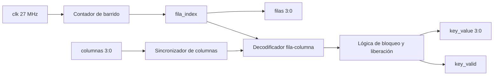
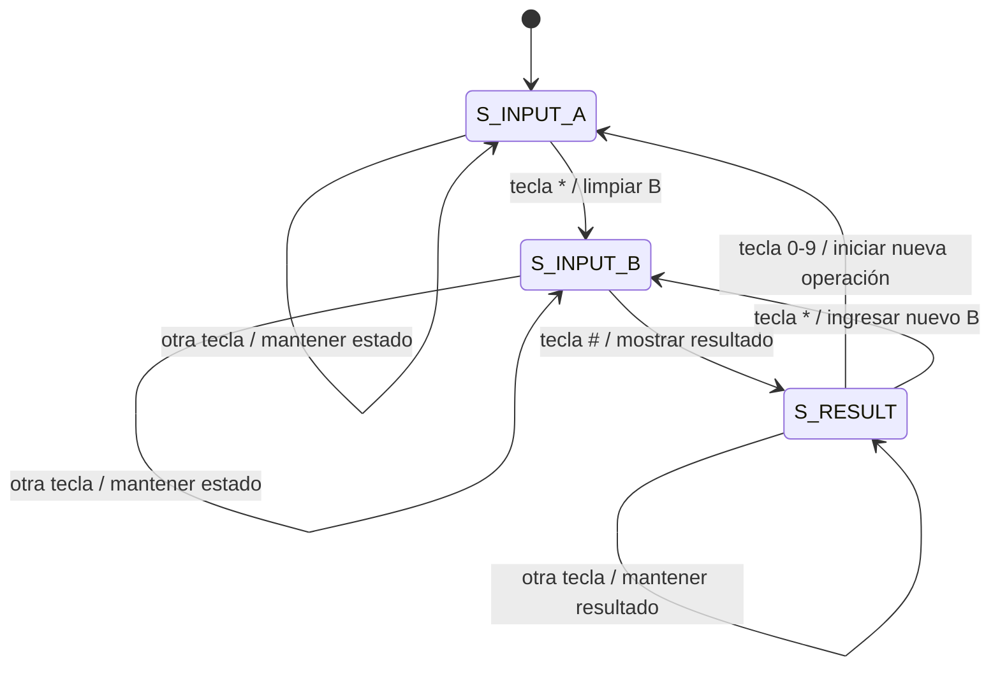
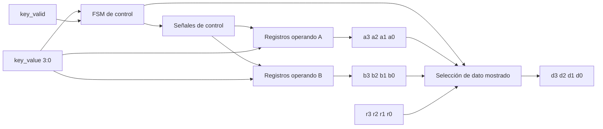
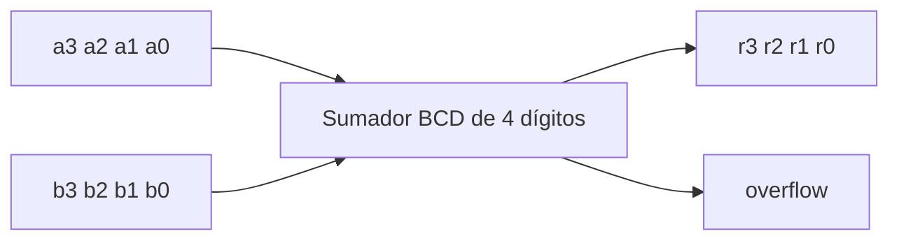
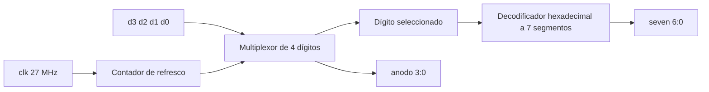
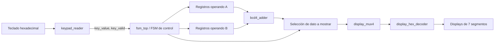

# Proyecto II: Diseño digital sincrónico en HDL

## 1. Abreviaturas y definiciones

- **FPGA**: *Field Programmable Gate Array*. Dispositivo lógico programable utilizado para implementar sistemas digitales.
- **HDL**: *Hardware Description Language*. Lenguaje utilizado para describir hardware digital.
- **SystemVerilog**: lenguaje de descripción de hardware utilizado para implementar el diseño del proyecto.
- **FSM**: *Finite State Machine*. Máquina de estados finitos utilizada para controlar la secuencia de operación del sistema.
- **BCD**: *Binary Coded Decimal*. Formato en el cual cada dígito decimal se almacena de forma independiente en 4 bits.
- **Debounce**: técnica utilizada para reducir o eliminar lecturas falsas generadas por el rebote mecánico de una tecla.
- **Multiplexado**: técnica que permite controlar varios displays utilizando señales compartidas y activando un display a la vez.
- **Tang Nano 9K**: tarjeta FPGA utilizada como plataforma de implementación.

## 2. Referencias

[1] Pong P. Chu. *FPGA Prototyping by SystemVerilog Examples*. Xilinx MicroBlaze MCS SoC Edition. Wiley, 2018.

[2] Andrew House. *Hex Keypad Explanation*. Noviembre de 2009. Disponible en: https://www-ug.eecg.toronto.edu/msl/nios_devices/datasheets/hex_expl.pdf

[3] David Medina. *Video tutorial para principiantes. Flujo abierto para TangNano 9K*. Julio de 2024. Disponible en: https://www.youtube.com/watch?v=AKO-SaOM7BA

[4] David Medina. *Wiki tutorial sobre el uso de la TangNano 9K y el flujo abierto de herramientas*. Mayo de 2024. Disponible en: https://github.com/DJosueMM/open_source_fpga_environment/wiki

[5] William James Dally y R. Curtis Harting. *Digital Design: A Systems Approach*. Cambridge University Press, 2012.

## 3. Introducción

El presente proyecto consiste en el diseño e implementación de un sistema digital sincrónico en una FPGA Tang Nano 9K utilizando SystemVerilog. El sistema permite capturar datos desde un teclado hexadecimal, almacenar dos números decimales positivos, realizar la suma aritmética de ambos y mostrar el resultado en cuatro displays de 7 segmentos.

El diseño se desarrolló de forma modular. Cada bloque cumple una función específica dentro del sistema: lectura del teclado, sincronización de señales externas, control mediante una máquina de estados finitos, almacenamiento de operandos, suma BCD y despliegue multiplexado. Esta organización facilita la verificación individual de los módulos y permite describir con claridad el flujo de datos desde la entrada física hasta la salida visual del sistema.

## 4. Definición del problema y objetivos

El problema planteado consiste en diseñar un circuito digital sincrónico capaz de capturar dos números enteros positivos desde un teclado hexadecimal, procesarlos dentro de la FPGA y desplegar la suma sin signo en cuatro displays de 7 segmentos. El sistema debe operar con el reloj de 27 MHz de la Tang Nano 9K y debe considerar la sincronización de las señales externas del teclado, debido a que estas no están originalmente alineadas con el reloj interno del sistema.

### 4.1 Objetivo general

Implementar un sistema digital sincrónico en SystemVerilog que capture dos números desde un teclado hexadecimal, realice su suma en formato decimal y muestre el resultado en displays de 7 segmentos.

### 4.2 Objetivos específicos

- Leer un teclado hexadecimal mediante el barrido de filas y la lectura de columnas.
- Sincronizar las señales externas del teclado con el reloj interno de la FPGA.
- Reducir el efecto del rebote mecánico mediante una lógica de bloqueo y espera de liberación de tecla.
- Controlar la captura de los operandos mediante una máquina de estados finitos.
- Almacenar los dígitos ingresados en registros internos.
- Implementar una suma BCD de cuatro dígitos.
- Multiplexar cuatro displays de 7 segmentos para mostrar el número ingresado o el resultado de la suma.
- Validar el funcionamiento del sistema mediante testbenches en SystemVerilog.

## 5. Descripción general del sistema

El sistema completo recibe como entrada las columnas de un teclado hexadecimal y genera como salida las señales de filas para el barrido del teclado, las señales de segmentos del display y las señales de selección de ánodo. El flujo de operación inicia en el módulo de lectura del teclado, el cual detecta una tecla presionada y entrega un código de 4 bits junto con una señal de validación. Posteriormente, la FSM interpreta ese código y decide si el dígito debe almacenarse como parte del primer número, como parte del segundo número o si debe mostrarse el resultado.

La tecla `*`, codificada internamente como `4'hE`, se utiliza como separador entre operandos. La tecla `#`, codificada como `4'hF`, se utiliza para solicitar la visualización del resultado. Las teclas numéricas de `0` a `9` se almacenan como dígitos BCD.

El diseño se compone de los siguientes módulos principales:

| Módulo | Función principal |
|---|---|
| `keypad_reader.sv` | Realiza el barrido del teclado, sincroniza las columnas y genera `key_value` y `key_valid`. |
| `fsm_top.sv` | Integra la lectura del teclado, la FSM de control, los registros de operandos, el sumador BCD y el despliegue. |
| `bcd4_adder.sv` | Realiza la suma decimal de cuatro dígitos BCD. |
| `display_mux4.sv` | Multiplexa los cuatro dígitos hacia los displays de 7 segmentos. |
| `display_hex_decoder.sv` | Convierte cada dígito de 4 bits en el patrón correspondiente para el display de 7 segmentos. |
| `system_top.sv` | Versión alternativa del módulo superior, con parte de la lógica de suma integrada directamente. |

En el informe se toma `fsm_top.sv` como módulo superior principal, ya que organiza el comportamiento del sistema mediante estados definidos y se ajusta directamente al criterio de control secuencial solicitado para el proyecto.

## 6. Criterio de diseño

El diseño se realizó de manera modular para separar la ruta de datos de la lógica de control. Esta decisión permite probar cada subsistema de forma independiente y simplifica la depuración del proyecto. En lugar de concentrar todo el comportamiento en un único bloque, el sistema se dividió en lectura de teclado, control de estados, suma y visualización.

La captura de datos se implementó mediante una FSM porque el sistema debe interpretar cada tecla según el contexto de operación. Una tecla numérica puede pertenecer al primer operando, al segundo operando o puede iniciar una nueva operación después de mostrar el resultado. Con la FSM se define este comportamiento de forma ordenada y sin ambigüedad.

Las señales del teclado son externas a la FPGA y, por lo tanto, asíncronas respecto al reloj interno. Para reducir el riesgo de metaestabilidad, las columnas se registran mediante dos flip-flops antes de ser utilizadas por la lógica principal. Además, se implementó una lógica de bloqueo para evitar que una misma pulsación sea registrada varias veces mientras la tecla permanece presionada.

La suma se realiza en formato BCD porque los datos ingresados y mostrados son decimales. Cada dígito se almacena de forma independiente en 4 bits, lo cual simplifica la conexión entre el bloque aritmético y el subsistema de despliegue. Esta decisión evita tener que convertir un número binario completo a decimal antes de mostrarlo en los displays.

El despliegue se implementó mediante multiplexado porque los cuatro displays comparten las mismas señales de segmentos. El sistema activa un ánodo a la vez y cambia rápidamente entre los cuatro dígitos, generando la percepción visual de que todos los displays se encuentran encendidos de forma simultánea.

## 7. Subsistema de lectura del teclado hexadecimal

El módulo `keypad_reader` se encarga de leer un teclado hexadecimal de matriz 4x4. Para esto, genera un barrido sobre las filas mediante la señal `filas[3:0]` y lee el estado de las columnas mediante `columnas[3:0]`.

El teclado se trabaja con lógica activa en bajo. En reposo, las columnas se mantienen en `4'hF`. Cuando se presiona una tecla, una de las columnas cambia a cero durante la fila que se encuentra activa. Con la combinación de fila activa y columna detectada se obtiene el código de la tecla presionada.

### 7.1 Funcionamiento interno

El módulo está compuesto por los siguientes elementos internos:

- `scan_cnt`: contador que define el tiempo durante el cual se mantiene activa cada fila.
- `fila_index`: índice que selecciona cuál fila se activa durante el barrido.
- `columnas_ff1` y `columnas_sync`: registros utilizados para sincronizar las entradas externas del teclado.
- `key_code`: código hexadecimal obtenido a partir de la combinación fila-columna.
- `key_valid`: pulso de un ciclo de reloj que indica la detección de una tecla válida.
- `locked`: bandera que bloquea nuevas detecciones mientras una tecla permanece presionada.
- `release_cnt`: contador que espera un tiempo de liberación antes de aceptar una nueva tecla.

### 7.2 Mapeo de teclas

| Fila activa | Columna detectada | Tecla |
|---|---|---|
| `1110` | `1110` | `* / E` |
| `1110` | `1101` | `0` |
| `1110` | `1011` | `# / F` |
| `1110` | `0111` | `D` |
| `1101` | `1110` | `7` |
| `1101` | `1101` | `8` |
| `1101` | `1011` | `9` |
| `1101` | `0111` | `C` |
| `1011` | `1110` | `4` |
| `1011` | `1101` | `5` |
| `1011` | `1011` | `6` |
| `1011` | `0111` | `B` |
| `0111` | `1110` | `1` |
| `0111` | `1101` | `2` |
| `0111` | `1011` | `3` |
| `0111` | `0111` | `A` |

Para la operación principal del sistema se utilizan los dígitos `0` a `9`, la tecla `*` como separador entre operandos y la tecla `#` como instrucción para mostrar el resultado.

### 7.3 Diagrama del subsistema de lectura



**Figura 1.** Diagrama de bloques del subsistema de lectura del teclado hexadecimal.

## 8. FSM de control principal

La máquina de estados principal se encuentra en el módulo `fsm_top.sv`. Su función es decidir qué acción debe realizarse cada vez que `keypad_reader` genera una tecla válida.

La FSM tiene tres estados:

| Estado | Función |
|---|---|
| `S_INPUT_A` | Captura el primer número. |
| `S_INPUT_B` | Captura el segundo número. |
| `S_RESULT` | Muestra el resultado de la suma. |

### 8.1 Estado `S_INPUT_A`

En este estado, las teclas numéricas se almacenan en los registros del primer operando `a3`, `a2`, `a1` y `a0`. Cada vez que se ingresa un nuevo dígito, los valores anteriores se desplazan hacia la izquierda:

```systemverilog
a3 <= a2;
a2 <= a1;
a1 <= a0;
a0 <= key_value;
```

Este mecanismo permite ingresar números de forma similar a una calculadora. Por ejemplo, al presionar `1`, `2`, `3`, el valor queda almacenado como `0123`. Cuando se presiona `*`, la FSM pasa al estado `S_INPUT_B` y limpia los registros del segundo operando.

### 8.2 Estado `S_INPUT_B`

En este estado, las teclas numéricas se almacenan en los registros `b3`, `b2`, `b1` y `b0`, usando el mismo esquema de desplazamiento. Si se presiona nuevamente `*`, se limpia el segundo operando. Si se presiona `#`, la FSM pasa al estado `S_RESULT`.

### 8.3 Estado `S_RESULT`

En este estado, el sistema muestra en los displays la suma calculada por el módulo `bcd4_adder`. Si el usuario presiona una tecla numérica, el sistema inicia una nueva operación y regresa a `S_INPUT_A`, usando esa tecla como primer dígito del nuevo operando. Si se presiona `*`, el sistema pasa nuevamente a la captura del segundo operando.

### 8.4 Diagrama de estados



**Figura 2.** Diagrama de estados de la FSM principal.

### 8.5 Diagrama del subsistema de control y registros


**Figura 3.** Diagrama de bloques del subsistema de control y registros.

## 9. Subsistema de suma aritmética

La suma se implementa en el módulo `bcd4_adder.sv`. Este bloque recibe dos operandos de cuatro dígitos BCD:

- Primer operando: `a3`, `a2`, `a1`, `a0`.
- Segundo operando: `b3`, `b2`, `b1`, `b0`.

La salida corresponde al resultado de la suma:

- Resultado: `r3`, `r2`, `r1`, `r0`.
- Bandera: `overflow`.

El módulo suma primero las unidades, luego las decenas, centenas y millares. Cada dígito se corrige mediante la función `add_bcd_digit`, la cual convierte valores de 0 a 18 en un dígito decimal de 0 a 9 y un acarreo. De esta manera, cuando la suma de dos dígitos supera 9, se genera un `carry` hacia el siguiente dígito.

Por ejemplo:

| Operación | Dígito resultante | Carry |
|---|---:|---:|
| `4 + 6 = 10` | `0` | `1` |
| `9 + 9 = 18` | `8` | `1` |

Este criterio se eligió porque el sistema trabaja directamente con dígitos decimales individuales. Por esta razón, el resultado queda listo para ser enviado al bloque de despliegue sin requerir una conversión binario-decimal adicional.

### 9.1 Diagrama del subsistema de suma



**Figura 4.** Diagrama de bloques del subsistema de suma BCD.

## 10. Subsistema de despliegue en 7 segmentos

El despliegue está formado por los módulos `display_mux4` y `display_hex_decoder`.

El módulo `display_mux4` recibe cuatro dígitos de 4 bits (`d3`, `d2`, `d1`, `d0`) y selecciona cuál de ellos se envía al decodificador de 7 segmentos. Para esto utiliza un contador `refresh_count`, del cual se toman los bits más significativos para seleccionar el dígito activo.

El módulo `display_hex_decoder` recibe un valor hexadecimal de 4 bits y entrega el patrón de segmentos correspondiente en la señal `seg[6:0]`. Aunque el decodificador permite representar valores de `0` a `F`, durante la operación principal del sistema se utilizan principalmente valores decimales de `0` a `9`.

La selección de ánodos se realiza con lógica activa en bajo:

| Selector | Dígito mostrado | Ánodo activo |
|---|---|---|
| `00` | `d3` | `1110` |
| `01` | `d2` | `1101` |
| `10` | `d1` | `1011` |
| `11` | `d0` | `0111` |

### 10.1 Diagrama del subsistema de despliegue



**Figura 5.** Diagrama de bloques del subsistema de despliegue multiplexado.

## 11. Interconexión general del sistema

El sistema completo se organiza como una ruta de datos controlada por la FSM. El teclado entrega el dato de entrada, el lector de teclado lo convierte en un código hexadecimal válido, la FSM decide en cuál registro debe almacenarse, el sumador calcula el resultado y el bloque de display selecciona qué valor debe mostrarse.



**Figura 6.** Diagrama general de interconexión del sistema.

## 12. Testbench y simulaciones

La verificación funcional del proyecto se realizó mediante testbenches individuales para los principales módulos del sistema. Los archivos de simulación se encuentran en la carpeta `src/sim`.

### 12.1 Testbench del sumador BCD

El archivo `tb_bcd4_adder.sv` verifica el módulo `bcd4_adder`. En este testbench se aplican diferentes combinaciones de operandos y se compara la salida obtenida con el resultado esperado.

| Operando A | Operando B | Resultado esperado |
|---:|---:|---:|
| `1234` | `0456` | `1690` |
| `0999` | `0999` | `1998` |
| `0000` | `0000` | `0000` |
| `1111` | `2222` | `3333` |
| `5000` | `4000` | `9000` |

La simulación confirma el comportamiento esperado del sumador y permite comprobar el manejo de acarreos entre dígitos decimales.


**Figura 7.** Simulación funcional del módulo `bcd4_adder`.

### 12.2 Testbench del multiplexor de display

El archivo `tb_display_mux4.sv` prueba el módulo `display_mux4`. Inicialmente se cargan los dígitos `1`, `2`, `3`, `4`, y luego se cambian por `9`, `8`, `7`, `6`. La simulación permite verificar que la señal `anodo` cambia periódicamente y que la salida `seven` corresponde al dígito seleccionado en cada instante.


**Figura 8.** Simulación funcional del módulo `display_mux4`.

### 12.3 Testbench del lector de teclado

El archivo `tb_keypad_reader.sv` valida el módulo `keypad_reader`. Para acelerar la simulación se modifican los parámetros `SCAN_DELAY` y `RELEASE_DELAY`. El testbench presiona virtualmente las teclas del teclado hexadecimal y comprueba que el módulo genera correctamente el código `key_value` junto con el pulso `key_valid`.


**Figura 9.** Simulación funcional del módulo `keypad_reader`.

### 12.4 Testbench del sistema con FSM

El archivo `tb_fsm_top.sv` verifica el sistema integrado. En este testbench se simulan secuencias completas de entrada de datos, utilizando `*` para pasar al segundo operando y `#` para mostrar el resultado.

| Secuencia simulada | Interpretación | Resultado esperado |
|---|---|---:|
| `1 2 3 4 * 4 5 6 #` | `1234 + 456` | `1690` |
| `9 9 9 * 9 9 9 #` | `999 + 999` | `1998` |

La verificación se realiza observando los registros internos `d3`, `d2`, `d1` y `d0`, los cuales representan los cuatro dígitos enviados al subsistema de despliegue. También se observan señales como `state`, `key_value`, `key_valid`, `filas`, `columnas`, `seven` y `anodo` para revisar la secuencia completa desde la entrada hasta la salida visual.


**Figura 10.** Simulación funcional del sistema completo mediante `tb_fsm_top`.

## 13. Consumo de recursos

El consumo de recursos debe obtenerse a partir del reporte de síntesis generado por las herramientas del flujo abierto. En esta sección se presenta la cantidad de recursos utilizados por el diseño dentro de la FPGA.

| Recurso | Cantidad |
|---|---:|
| VCC | 1 / 1 (100 %) |
| SLICE | 560 / 8640 (6 %) |
| IOB | 21 / 274 (7 %) |
| ODDR | 0 / 274 (0 %) |
| MUX2_LUT5 | 95 / 4320 (2 %) |
| MUX2_LUT6 | 37 / 2160 (1 %) |
| MUX2_LUT7 | 14 / 1080 (1 %) |
| MUX2_LUT8 | 7 / 1056 (0 %) |
| GND | 1 / 1 (100 %) |
| RAMW | 0 / 270 (0 %) |
| GSR | 1 / 1 (100 %) |
| OSC | 0 / 1 (0 %) |
| rPLL | 0 / 2 (0 %) |

El reporte de utilización muestra que el diseño utiliza 560 de 8640 slices disponibles, equivalente a un 6 % del dispositivo. Además, se utilizan 21 pines de entrada/salida de 274 disponibles, equivalente a un 7 %. Esto indica que el diseño ocupa una fracción pequeña de los recursos disponibles en la FPGA.

## 14. Reporte de temporización y frecuencia máxima

El diseño fue planteado para funcionar con el reloj de 27 MHz de la Tang Nano 9K. Para validar este requisito se revisa el reporte de temporización generado durante el proceso de síntesis, colocación y ruteo. El criterio de aceptación es que la frecuencia máxima reportada sea mayor o igual a la frecuencia requerida de 27 MHz.

| Parámetro | Valor |
|---|---:|
| Frecuencia requerida | `27 MHz` |
| Frecuencia máxima reportada | `162.44 MHz` |
| Slack | Positivo |
| Cumplimiento | Cumple |

El reporte de temporización indica una frecuencia máxima de operación de 162.44 MHz para el reloj `display_inst.clk`, con resultado `PASS` para la frecuencia objetivo de 27 MHz. Por lo tanto, el diseño cumple con el requisito mínimo de operación establecido para la Tang Nano 9K.

## 15. Análisis de problemas encontrados y soluciones aplicadas

Durante el desarrollo del sistema se identificaron varios puntos importantes relacionados con la lectura del teclado, el control de operación y la representación decimal de los datos.

### 15.1 Lectura confiable del teclado

Las señales provenientes del teclado son externas y pueden generar lecturas inestables si se utilizan directamente. Para resolver este problema, las columnas se registraron mediante dos flip-flops antes de ingresar a la lógica principal del lector de teclado. Con esto se reduce el riesgo de metaestabilidad y se adapta la señal externa al dominio de reloj de la FPGA.

### 15.2 Múltiples capturas por una sola pulsación

Al mantener presionada una tecla, el sistema podía detectar la misma pulsación más de una vez. Para evitarlo se implementó la señal `locked`, la cual bloquea nuevas detecciones después de capturar una tecla válida. El sistema vuelve a aceptar otra tecla únicamente cuando las columnas regresan al estado de reposo y se cumple el tiempo definido por `release_cnt`.

### 15.3 Definición del flujo de operación

El sistema debía distinguir si una tecla numérica pertenecía al primer operando, al segundo operando o a una nueva operación. Para resolverlo se implementó una FSM con tres estados: captura de A, captura de B y visualización del resultado. Esta estructura permite controlar el flujo de forma clara y reduce ambigüedades en la interpretación de las teclas.

### 15.4 Representación decimal del resultado

Como el resultado debe mostrarse en displays de 7 segmentos en formato decimal, se decidió trabajar con dígitos BCD. Esta representación simplifica el paso desde los registros del sistema hacia el despliegue, ya que cada dígito puede enviarse directamente al decodificador de 7 segmentos.

### 15.5 Diferencia entre `system_top` y `fsm_top`

Durante el desarrollo se trabajaron dos módulos superiores similares. El módulo `system_top` integra parte de la lógica directamente mediante banderas como `entering_B` y `show_result`. En cambio, `fsm_top` organiza el control de forma explícita mediante los estados `S_INPUT_A`, `S_INPUT_B` y `S_RESULT`, además de instanciar el módulo `bcd4_adder`. Por esta razón, `fsm_top` se considera la versión principal para la descripción del diseño final.

## 16. Implementación física

La implementación física del sistema conecta la FPGA Tang Nano 9K con el teclado hexadecimal y los cuatro displays de 7 segmentos. El teclado funciona como dispositivo de entrada, mientras que los displays se utilizan para mostrar el número que se está ingresando o el resultado de la suma.


**Figura 11.** Montaje físico del sistema con teclado hexadecimal, FPGA y displays de 7 segmentos.

## 17. Ejercicios 

### 17.1 Contadores sincrónicos 74LS163

¿Qué hace la salida RCO en un 74LS163?

R/ La salida RCO (Ripple Carry Output) indica que el contador alcanzó su valor máximo (1111) y que las señales de habilitación se encuentran activas. Esta salida se utiliza para encadenar varios contadores y permitir que el siguiente avance cuando el primero complete su ciclo.

Explique por qué RCO y T están conectadas entre los dos contadores y explique cómo trabaja esta conexión.

R/ La conexión entre RCO del primer contador y la entrada T (ENT) del segundo permite implementar un conteo en cascada. Cuando el primer contador completa sus 16 estados, la salida RCO genera un pulso que habilita el avance del segundo contador. De esta forma, el segundo contador únicamente incrementa su valor cuando el primero desborda, logrando así un contador de mayor cantidad de bits y una división de frecuencia de la señal original.

¿Cuál es la diferencia entre las entradas T y P del 74LS163?

R/ Las entradas ENP y ENT son señales de habilitación del contador. Ambas deben estar en alto para permitir el conteo normal. Sin embargo, la diferencia principal es que ENT también habilita la generación de la señal RCO, mientras que ENP no afecta directamente dicha salida.

¿Cuánto toma, luego del flanco positivo de reloj, para que uno de los flip-flops cambie de estado?

R/ El cambio de estado ocurre después del tiempo de propagación interno del flip-flop, el cual típicamente se encuentra en el rango aproximado de 10 ns a 20 ns según la hoja de datos del dispositivo.

¿Importa cuál bit de salida se escoja? Explique.

R/ Sí importa, ya que cada bit cambia con una frecuencia distinta. Aunque todos los flip-flops son sincronizados por el mismo reloj, las salidas representan divisiones diferentes de frecuencia. Por ejemplo, Qa cambia a la mitad de la frecuencia del reloj, mientras que Qd cambia a una dieciseisava parte de dicha frecuencia. Por ello, dependiendo del bit seleccionado, la señal observada tendrá una velocidad de cambio distinta.

Use la opción de captura de fallas en el osciloscopio para localizar posibles fallas. Explique en qué casos es esperable hallar esta falla.

R/ Las fallas o glitches pueden aparecer debido a diferencias en los tiempos de propagación internos de los flip-flops y la lógica combinacional. Estas transiciones breves suelen observarse cuando varias salidas cambian simultáneamente y la señal RCO conmuta entre alto y bajo. Debido a que los cambios no ocurren exactamente al mismo instante, pueden generarse pulsos espurios de corta duración.

### 17.2 Cerrojo Set-Reset con compuertas NAND

En este ejercicio se debe construir un cerrojo Set-Reset utilizando compuertas NAND 74HC00. El circuito se prueba con señales de entrada `S` y `R`, y se verifica el comportamiento de las salidas `Q` y `QN` en función del estado del reloj.


**Figura 12.** diagrama del cerrojo SR construido con compuertas NAND.


**Figura 13.** Tabla de verdad del SR_Latch.

Funcionamiento del circuito

El latch S-R sincronizado con reloj funciona mediante dos etapas principales. En la primera etapa, dos compuertas NAND reciben las señales de entrada Set (S), Reset (R) y Clock (CLK). Estas compuertas determinan cuándo las señales de control pueden afectar el estado interno del latch.

En la segunda etapa, otras dos compuertas NAND realimentadas generan las salidas Q y Q̅. Gracias a esta realimentación cruzada, el circuito puede almacenar un estado binario incluso después de que las entradas cambien.

Cuando CLK se encuentra en bajo, el circuito conserva su estado previo. En cambio, cuando CLK está en alto, las entradas S y R pueden modificar el valor almacenado. Si S se activa, la salida Q pasa a alto; si R se activa, Q pasa a bajo.

La principal utilidad de este cerrojo consiste en el almacenamiento temporal de un bit de información y su complemento, siendo uno de los bloques fundamentales para sistemas secuenciales y memorias digitales.
## 18. Conclusiones

El proyecto permitió implementar un sistema digital sincrónico completo en una FPGA, integrando lectura de señales externas, control secuencial, almacenamiento de datos, suma aritmética y visualización en displays de 7 segmentos. La división modular facilitó la verificación del sistema, ya que cada bloque pudo analizarse por separado antes de integrarse en el módulo superior.

La FSM principal permitió controlar de forma clara el flujo de operación del sistema, diferenciando entre la captura del primer número, la captura del segundo número y la visualización del resultado. Además, el uso de registros y sincronización permitió adaptar las señales externas del teclado al dominio de reloj interno de la FPGA.
